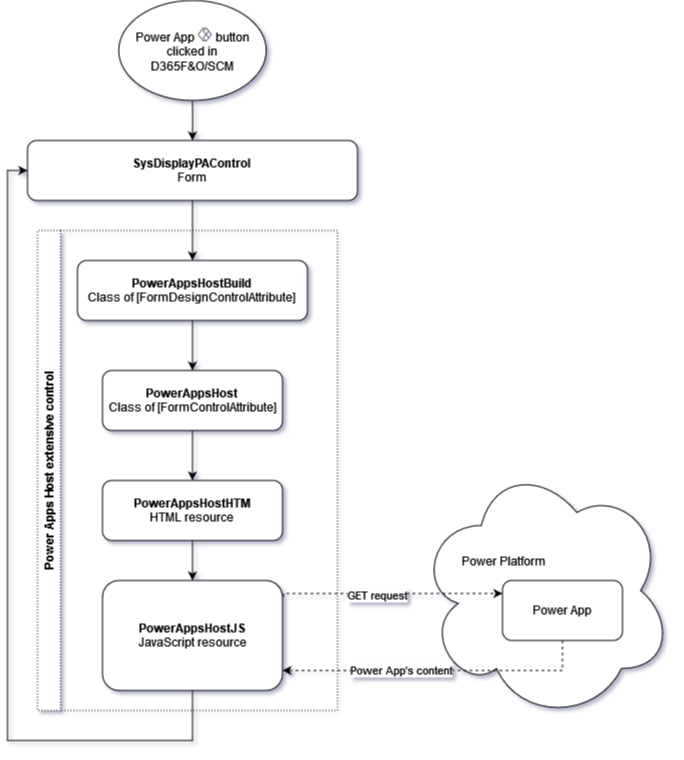
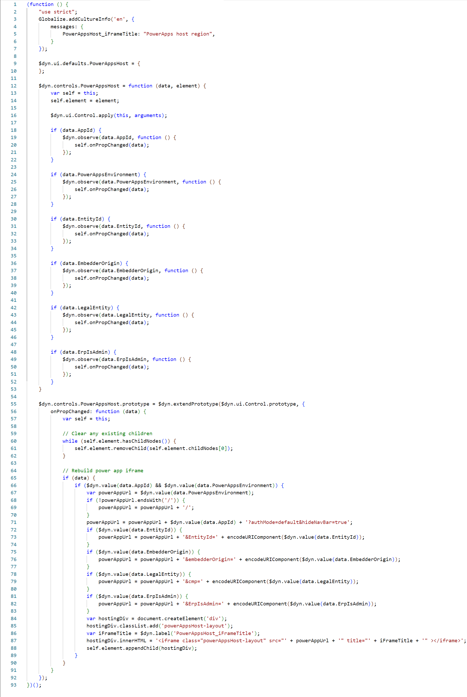
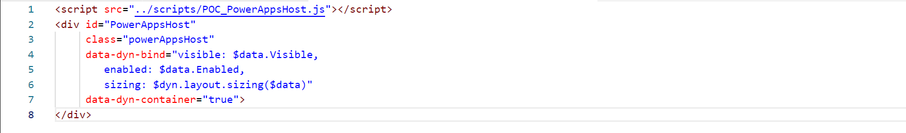
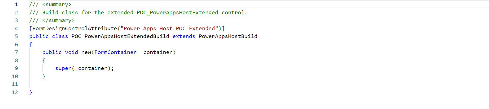
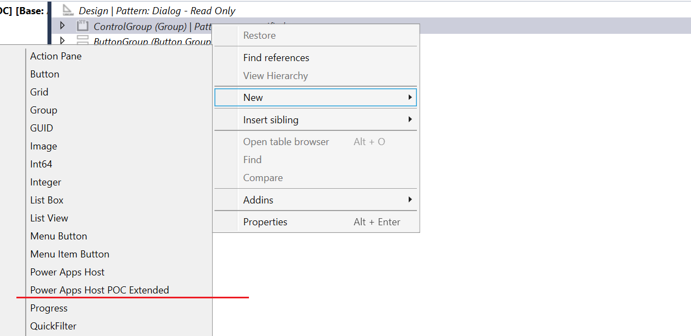
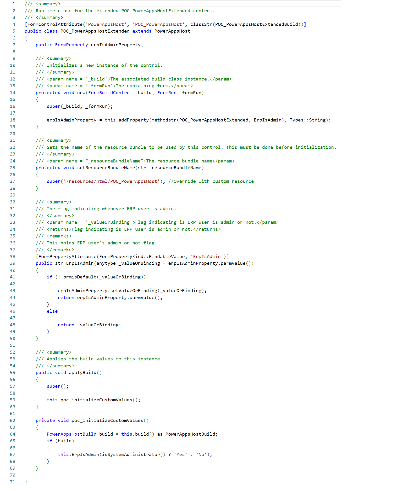
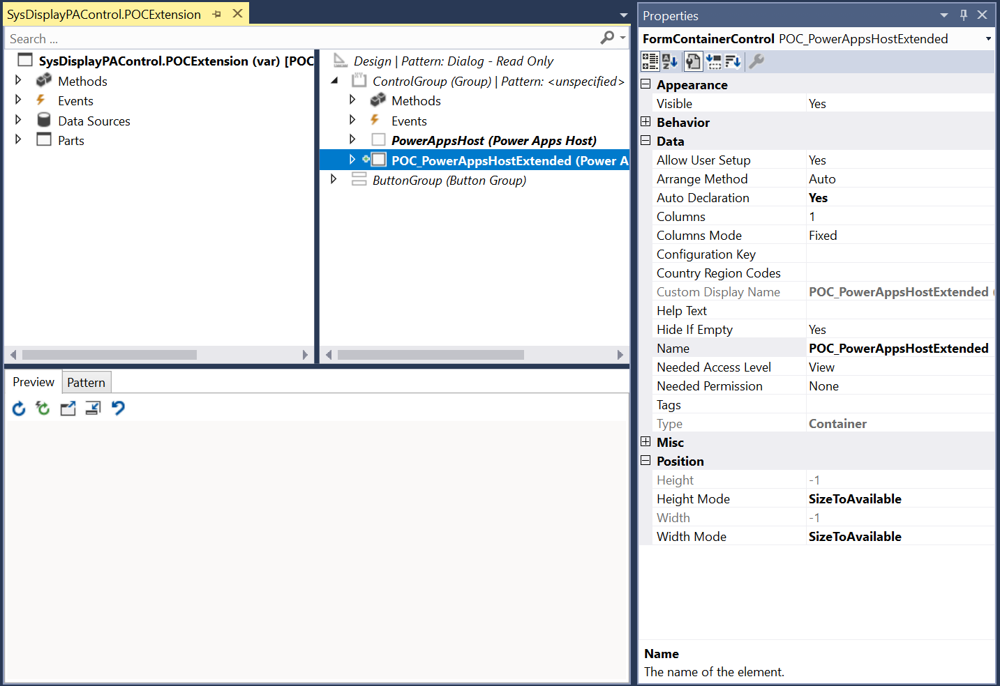
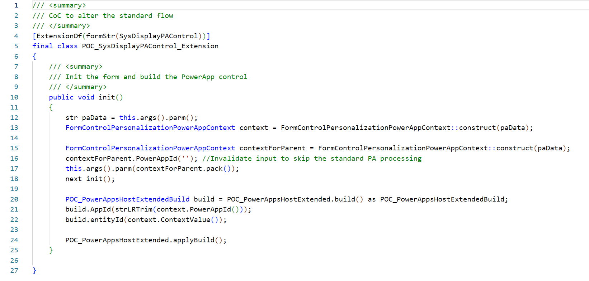
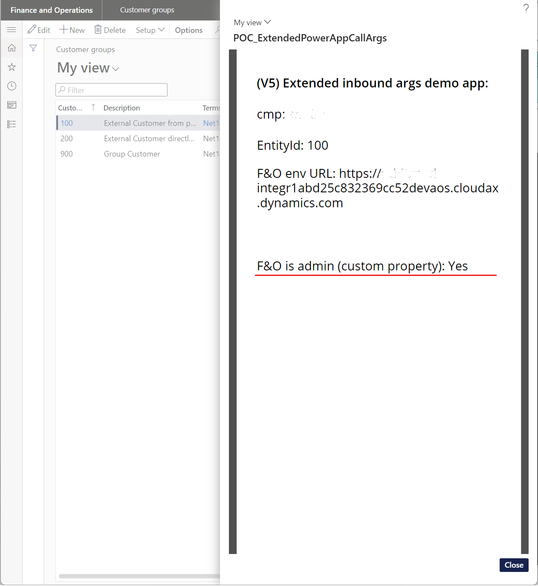
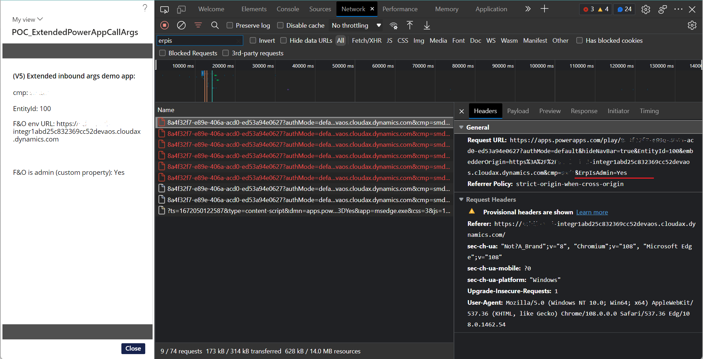

# Expand-Dynamics-FO-SCM-to-Power-Apps-integration

Have you thought how to pass more arguments from D365F&O/SCM (F&O) into embedded Power App and make your Flows more intelligent?

If so, you're not alone. As you know, it is possible to pass a selected record's ID, a legal entity context and, as I wrote in my previous [post](https://www.linkedin.com/posts/oleksandr-dudarenko_embed-canvas-apps-from-power-apps-finance-activity-7011621263030816769-fq8A?utm_source=share&utm_medium=member_desktop), the URL of the F&O environment that triggered the Power App.

Such state of things covering majority of business scenarios, but what can we do to get more? We can extend the standard X++ mechanism by enchanting the Power App integration process with more arguments that will be packed on the F&O side and sequentially passed to a Power App. And next it is possible to implement some logic, based on those extra parameters.

  

Several real-life scenarios may include:

*   Passing extra information from the data source, such as key fields and not only one field, as it is done withing the standard implementation;
*   File which generated/stored inside F&O, such as pictures or documents, that is converted to a Base64 string. Be aware by a by-design limit of the GET request size which is equal to 4Mb;
*   Integration messages generated by F&O, such as JSON/XML/CSV etc.

Of course these scenarios can be solved by other approaches and even by out-of-the-box mechanisms, but IMO it is good to be familiar with the one more approach.

  

Please be aware that it is ⚠ not safe ‼️ to pass sensitive information to Power Apps from the F&O because data within the GET request can be easily intercepted. It is not encrypted at all. If you would like, I can prepare a post where I will describe how to intercept data from your browser to F&O/Power Apps, including data from encrypted POST requests. Furthermore, I know how to protect our data. 📡 Please tell me what you're 🔭 interested in 🔬

  

* * *

Power Apps embedded into F&O are represented by the PowerAppsHost extensive control. In other words, it is a simple HTML with an iFrame container that loading a Power App by a provided URL.

More information about extensive controls development can be found in this article: [Extensible control programming reference](https://learn.microsoft.com/en-us/dynamics365/fin-ops-core/dev-itpro/user-interface/extensible-control-programming-reference)

  

Each time you open a Power App from the F&O UI, the GET request is issued toward the Power Platform as described in this article: [Launch and Param functions in Power Apps](https://learn.microsoft.com/en-us/power-platform/power-fx/reference/function-param#param)

My idea was to expand integration capabilities by injecting additional GET parameter(s) into the GET request URL, which can be later extracted on the receiver's side (in a Power App), rendered and shown in the F&O UI. As a sample, I decided to pass **ErpIsAdmin** parameter that will indicate “Yes” when F&O user is admin and “No” when he's not.

  

There are 3 possible ways to solve this challenge:

1.  Duplicate the standard extensive control and inject its constructor during runtime.
2.  Extend using CoC (Chain of Command). The cleaner option. But, sad fact that as for now this is not actually the way because the added into CoC extension properties can't be properly invoked by kernel. The CIL CoC helper works in a wrong way, in other words, it is an issue with CoC reflection. If anyone from the Microsoft product 🤝 group will contact me, I'll describe the issue in more details, so we can fix that together.
3.  Inherit from the standard extensive control, instantiate together with the standard one, and place it next to hidden standard control. This is the way I selected today.

  

Power Apps Host Extensive component architecture is presented by two classes and several resources of HTML, CSS, and JavaScript types:

  

* * *

Solution consists of 3 parts:

1.  Expand the PowerAppsHost control with one more computed attribute/parameter;
2.  Introduce the changed control to the standard SysDisplayPAControl form, so all standard mechanisms should work together with custom stuff;
3.  Create a Power App to test our changes.

  

**Let's begin with HTML and JavaScript**

Interaction with Power App is done by a .js script that is stored inside of POC\_PowerAppsHostJS AOT resource. It should contain POC\_PowerAppsHost.js file:

Next, we should have an HTML resource POC\_PowerAppsHostHTM, which is a copy of the standard PowerAppsHostHTM. This should contain POC\_PowerAppsHost.htm file that pointing to the custom JavaScript file:

  

**Time for X++ code!**

Created POC\_PowerAppsHostExtendedBuild class to be able to select the custom control in the VS forms designer, and to declare other fields that can be used in the VS form designer as the control's Behavioural properties. Custom control's properties are out of the scope of this article.

  

As this class is saved, you already can pick up this new control in the VS form designer:

  

Next class POC\_PowerAppsHostExtended is responsible for the control's logic:

That's pretty all objects required by the extensive control. It's time to add our control to a standard SysDisplayPAControl form, hide the standard control by setting Visible to false, and copying all properties to our custom control, such as auto declaration, width, and height. To achieve that, I created extension SysDisplayPAControl.POCExtension:

Now it is necessary to change the form's behaviour to prevent Power App's twice execution (standard and custom). Because each control will invoke the Power App, so I would like to invalidate input to a standard control, and it will do nothing. To accomplish that, I created CoC form extension class POC\_SysDisplayPAControl\_Extension:

  

**Time to test!**

To ensure that our new control is passing an extra ErpIsAdmin parameter within the GET request, I created a Power App where inbound arguments are extracted as I described in my previous post. As app is embedded into F&O, I can see that it's getting new parameter:

Furthermore, it is possible to see the request in the browser's Development Utils:

  

That's it 😉

  

Thank you for your attention!

Please reach out to me if any questions. And I will be happy for your feedback.

Don't hesitate to tell me what topic you would like me to describe in more details.

  

[#dynamics365](https://www.linkedin.com/feed/hashtag/dynamics365) [#d365fo](https://www.linkedin.com/feed/hashtag/d365fo) [#convergence](https://www.linkedin.com/feed/hashtag/convergence) [#powerplatform](https://www.linkedin.com/feed/hashtag/powerplatform) [#powerapps](https://www.linkedin.com/feed/hashtag/powerapps) [#integration](https://www.linkedin.com/feed/hashtag/integration) [#erp](https://www.linkedin.com/feed/hashtag/erp) [#edi](https://www.linkedin.com/feed/hashtag/edi)